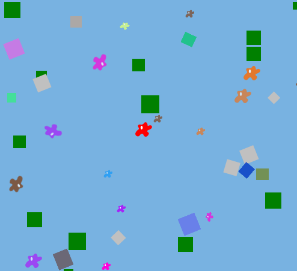
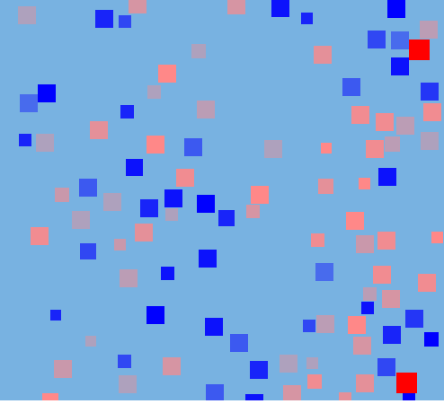

crafty-survival
===============

Survival simulation "games" - blobs and mating for now.

Just some random blobs with random movement, random rotation:

This one is more interesting.

* Red = Female / Blue = Male (obviously)
* Each blob can move randomly about
* Blobs age and die at age 101
* Each male/female meeting can result in conception if
** Both parties are of age (20)
** The female is not already pregnant
** The product of their fertility is higher than a random value
* The more transparent the less fertile
* Females get 10% less fertile after each pregnancy
* Offspring are small and grow until age 20

# Components
* Being: A being has an age, a sex (50/50 Male/Female)
* Blob: A (scalable!) sprite which should look like an amoeba or something
* Bounce: Harder than it looks: bounce back when you collide
* Bound: Keeps a 2D entity inside the limits
* Colorful: A random RGB color
* Female: Can conceive, goes through 9 cycles of pregnancy then gives birth
* Male: Can't really do anything (see Sex below)
* Mobility: Move about with random acceleration (mingle)
* Plant: A green thing which doesn't move
* Sex: Allows a Female to conceive if she meets a Male and all goes well
* Sounds: Play a sound based on an event (e.g. Conceive or Birth)
* Squishy: Linear resizing (pulsating) bigger...smaller
* Turning: Random rotation